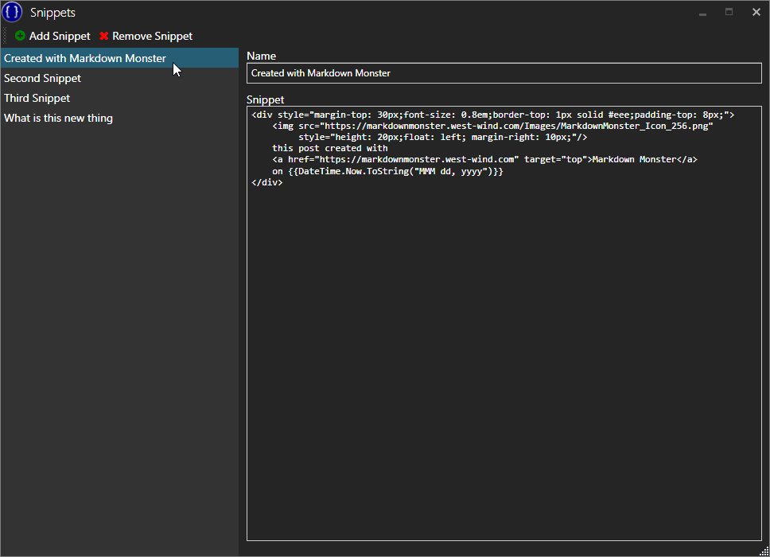

# Snippets Markdown Monster Add-in


This project provides a simple snippet manager addin for the Markdown [Monster Markdown Editor and Weblog Publisher](https://markdownmonster.west-wind.com). The addin lets you embed expanded snippets with optional C# expressions or C# Razor code into your Markdown Monster document. 

You can store and select from a list of text based snippets that you can embed into your Markdown or HTML documents by **double clicking**, pressing `ENTER` or `SPACE`.



Snippets make a great use case for:

* Signatures
* Page or Support Templates
* Prefilled Bug Reports
* Timestamping documents


> #### Early pre-release
> This version is a pre-release version so installation and configuration is manual for now. Please see instructions below.

### Embed C# Code Expressions
Snippets can contain embedded C# code expressions using `{{ expression }}` syntax which is evaluated when the snippet is rendered.

For example the following:

```html
<div class="small">
   created by, Rick Strahl, on 
   {{DateTime.Now.ToString("MMM dd, yyyy")}}
</div>   
```

embeds a date into the snippet when it's created. Snippets can embed **any** text since Markdown supports both plain text as well as HTML markup as in the example above.

You also get access to the full Addin model that exposes a large chunk of Markdown Monsters active document, editor and UI using a `Model property.

For example:

```html
Full Filename: {{Model.ActiveDocument.Filename}}
```

You only get to apply expressions, but that gives you a fair bit of functionality you can work with.


### Embed C# Razor Code
If you need more control, you can also use ASP.NET Style Razor syntax for snippets. Here's an example of using Razor to embed expressions and run code snippets.

The following template accesses the Markdown Monster Model data to get data out of the documents.

```html
Main Window Title:  @Model.Window.Title. 

Timestamp: @DateTime.Now.ToString("MMM dd, yyy")

Filename: @Model.ActiveDocument.Filename

Open Documents:
@foreach(var doc in Model.OpenDocuments) {
    <text>* @doc.Filename</text>
}
```


### Expansion Keys
You can also create a *shortcut* extension key combination. When you type the key sequence and wait for the type timeout (around 800ms) the snippet is expanded in place to allow for keyboard based extension.

For example, in the screen shot the **rdt** combination is set up for the script. So if I type **rdt** in the editor and wait for a second the associated snippet is expanded.

### Open for Feedback
Currently this is just a first cut for snippets. There are a number of things that can be done with this but I'm curious how people might want to use this.

#### Scripting Engine
Currently the templates use a simple **{{ Handlebar-like }}** expression syntax that can be embedded into a document. Another option might be to embed a full fledged **Razor Engine** using ASP.NET Style razor syntax to allow much more elaborate scripting.

The latter offers some pretty significant opportunities for generating mail merge like capabilities into Markdown Monster, so I'm leaning towards that. It might also be possible to support both styles since the expression engine is very small and light weight.

#### Code expansion
Adding support for code expansion in the editor so that if you type a letter combination the snippet will fire if the snippet window is open (and perhaps even when not). 

#### Feedback: Use Issues
If you have any thoughts or ideas on this please chime in in the [Issues section](https://github.com/RickStrahl/Snippets-MarkdownMonster-Addin/issues).


### How it works

## Configuration

### Related Links

* [Markdown Monster](https://markdownmonster.west-wind.com)
* [Creating a Markdown Monster Addin](https://markdownmonster.west-wind.com/docs/_4ne0s0qoi.htm)
