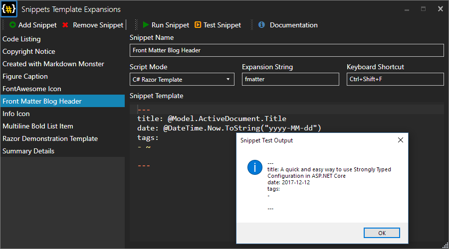

# Snippets Markdown Monster Add-in


This project provides a simple snippet manager that lets you embed common snippets of Markdown or HTML into your Markdown Monster document. You can store and select from a list of text based snippets that you can embed into your Markdown or HTML documents by double clicking, pressing `ENTER` or `SPACE`.



Snippets make a great use case for:

* Signatures
* Page or Support Templates
* Prefilled Bug Reports
* Timestamping documents

### Embed C# Code Expressions
Snippets can contain embedded C# code expressions using `{{ expression }}` syntax which is evaluated when the snippet is rendered.

For example the following:

```markdown
<div class="small">
   created by, Rick Strahl, on {{DateTime.Now.ToString("MMM dd, yyyy")}}
</div>   
```

embeds a date into the snippet when it's created.

You also get access to the full Addin model that exposes a large chunk of Markdown Monsters active document, editor and UI using a `Model property. 

For example, if you want to get the current filename:

```Markdown
Main Window Title:  {{Model.Window.Title}}. 

Time is: {{DateTime.Now}}

Filename: {{Model.ActiveDocument.Filename}}
```

You only get to apply expressions, but that gives you a fair bit of functionality you can work with.

> #### Early pre-release
> This version is a pre-release version so installation and configuration is manual for now. Please see instructions below.

### How it works

## Configuration


